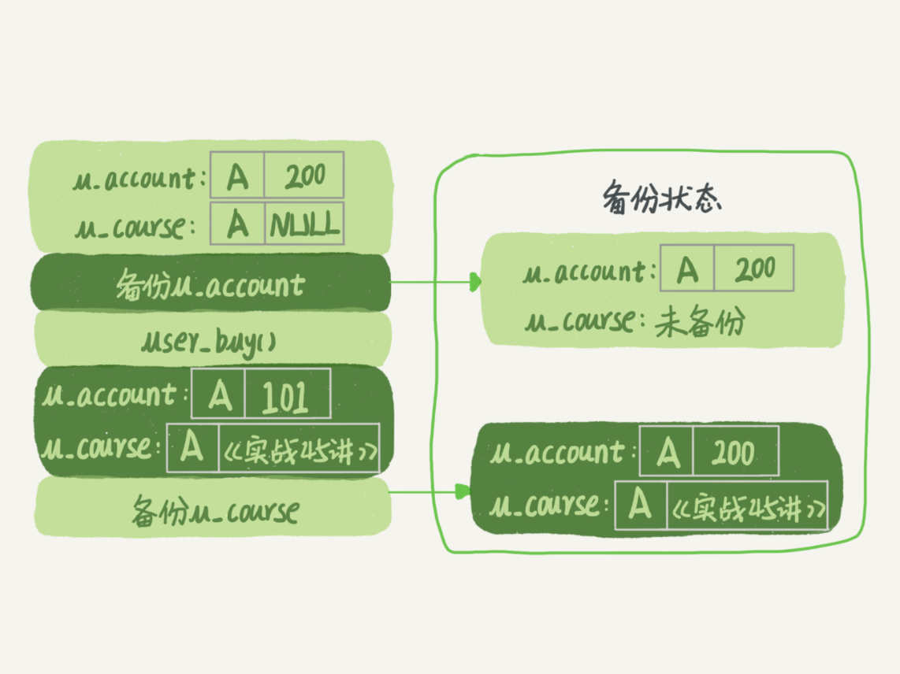
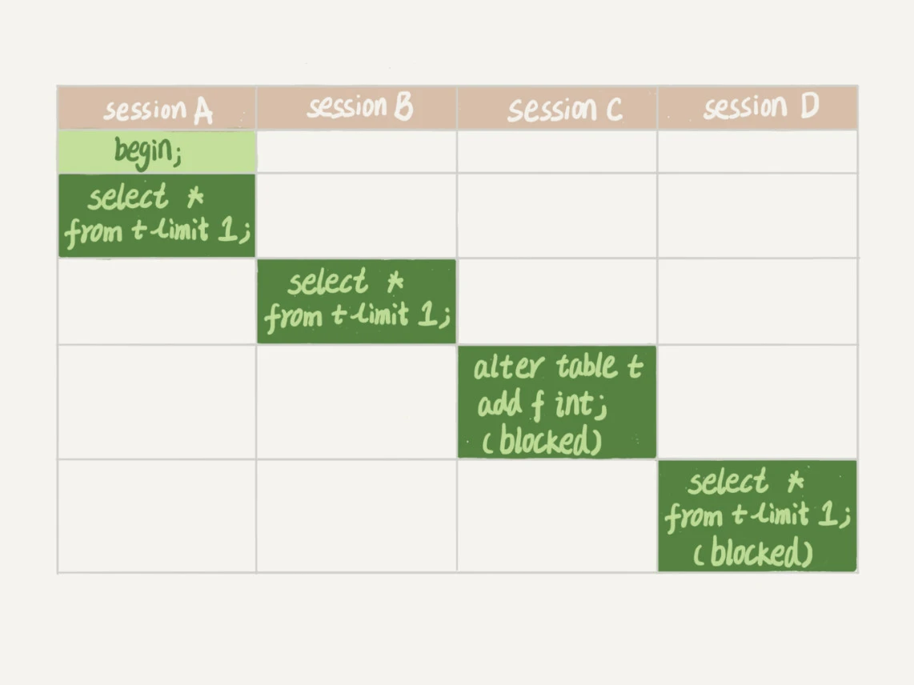
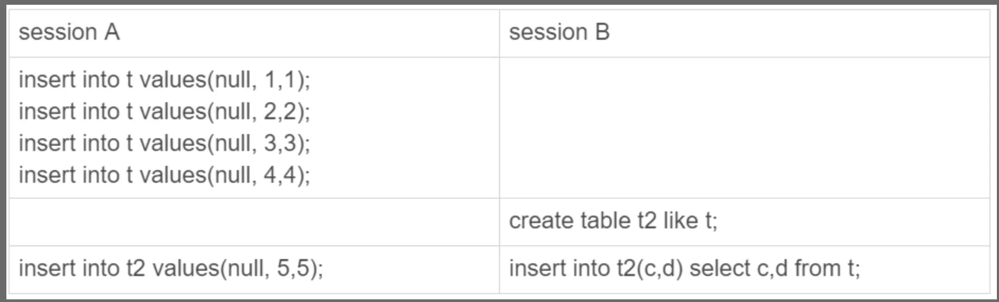

**根据加锁的范围，MySQL里面的锁大致可以分成全局锁、表级锁和行锁三类**


# 全局锁


全局锁就是对整个数据库实例加锁。MySQL提供了一个加全局读锁的方法，命令是 Flush tables with read lock (FTWRL)。
当需要让整个库处于只读状态的时候，可以使用这个命令，之后其他线程的以下语句会被阻塞：数据更新语句（数据的增删改）、数据定义语句（包括建表、修改表结构等）和更新类事务的提交语句。

**全局锁的典型使用场景是，做全库逻辑备份。也就是把整库每个表都select出来存成文本。

## FTWRL机制

以前有一种做法，是通过FTWRL确保不会有其他线程对数据库做更新，然后对整个库做备份。注意，在备份过程中整个库完全处于只读状态。

但是让整库都只读：

- 如果在主库上备份，那么在备份期间都不能执行更新，业务基本上就得停摆；
- 如果在从库上备份，那么备份期间从库不能执行主库同步过来的binlog，会导致主从延迟。

## 备份不加锁后果

> 假设现在要维护的系统，关注的是用户账户余额表和用户课程表。
> 现在发起一个逻辑备份。假设备份期间，有一个用户，购买了一门课程，业务逻辑里就要扣掉他的余额，然后往已购课程里面加上一门课。
> 如果时间顺序上是先备份账户余额表(u\_account)，然后用户购买，然后备份用户课程表(u\_course)，会怎么样呢？



业务和备份状态图

可以看到，这个备份结果里，用户A的数据状态是“账户余额没扣，但是用户课程表里面已经多了一门课”。
如果备份表的顺序反过来，先备份用户课程表再备份账户余额表，刚好相反

也就是说，不加锁的话，备份系统备份的得到的库不是一个逻辑时间点，这个视图是逻辑不一致的。

事务隔离，其实是有一个方法能够拿到一致性视图的；在可重复读隔离级别下开启一个事务。

官方自带的逻辑备份工具是mysqldump。当mysqldump使用参数–single-transaction的时候，导数据之前就会启动一个事务，来确保拿到一致性视图。而由于MVCC的支持，这个过程中数据是可以正常更新的。

## 使用FTWRL的场景：

**一致性读是好，但前提是引擎要支持这个隔离级别。比如，对于MyISAM这种不支持事务的引擎，如果备份过程中有更新，总是只能取到最新的数据，那么就破坏了备份的一致性。这时，就需要使用FTWRL命令了。

所以，**single-transaction方法只适用于所有的表使用事务引擎的库。如果有的表使用了不支持事务的引擎，那么备份就只能通过FTWRL方法。这往往是DBA要求业务开发人员使用InnoDB替代MyISAM的原因之一。

> **既然要全库只读，为什么不使用set global readonly=true的方式?**
确实readonly方式也可以让全库进入只读状态，但还是会建议用FTWRL方式，主要有两个原因：

- 一是，在有些系统中，readonly的值会被用来做其他逻辑，比如用来判断一个库是主库还是备库。因此，修改global变量的方式影响面更大，不建议使用。
- 二是，在异常处理机制上有差异。如果执行FTWRL命令之后由于客户端发生异常断开，那么MySQL会自动释放这个全局锁，整个库回到可以正常更新的状态。而将整个库设置为readonly之后，如果客户端发生异常，则数据库就会一直保持readonly状态，这样会导致整个库长时间处于不可写状态，风险较高。

业务的更新不只是增删改数据（DML)，还有可能是加字段等修改表结构的操作（DDL）。不论是哪种方法，一个库被全局锁上以后，要对里面任何一个表做加字段操作，都是会被锁住的。

# 表级锁

## 表级锁类型
- 表锁；
- 元数据锁（meta data lock，MDL）;
- 意向锁；
- AUTO-INC 锁；

## 表级锁语法

**表锁的语法是 lock tables … read/write。与FTWRL类似，可以用unlock tables主动释放锁，也可以在客户端断开的时候自动释放。需要注意，lock tables语法除了会限制别的线程的读写外，也限定了本线程接下来的操作对象。

>举个例子, 如果在某个线程A中执行`lock tables t1 read, t2 write`; 这个语句，则其他线程写t1、读写t2的语句都会被阻塞。同时，线程A在执行`unlock tables`之前，也只能执行读t1、读写t2的操作。连写t1都不允许，自然也不能访问其他表。

在还没有出现更细粒度的锁的时候，表锁是最常用的处理并发的方式。而对于InnoDB这种支持行锁的引擎，一般不使用lock tables命令来控制并发，毕竟锁住整个表的影响面还是太大。

**另一类表级的锁是MDL（metadata lock)。MDL不需要显式使用，在访问一个表的时候会被自动加上。MDL的作用是，保证读写的正确性。如果一个查询正在遍历一个表中的数据，而执行期间另一个线程对这个表结构做变更，删了一列，那么查询线程拿到的结果跟表结构对不上，肯定是不行的。

## MDL
### MDL作用

因此，在MySQL 5.5版本中引入了MDL，当对一个表做增删改查操作的时候，加MDL读锁；当要对表做结构变更操作的时候，加MDL写锁。

- 读锁之间不互斥，因此可以有多个线程同时对一张表增删改查。
    
- 读写锁之间、写锁之间是互斥的，用来保证变更表结构操作的安全性。因此，如果有两个线程要同时给一个表加字段，其中一个要等另一个执行完才能开始执行。
    
### MDL阻塞
虽然MDL锁是系统默认会加的，但却是不能忽略的一个机制。**事务执行期间，MDL 是一直持有的**，会导致后续的申请读锁的查询操作也会被阻塞：
 * 申请 MDL 锁的操作会形成一个队列，队列中**写锁获取优先级高于读锁**，一旦出现 MDL 写锁等待，会阻塞后续该表的所有 CRUD 操作。
比如下面这个例子，经常看到有人掉到这个坑里：给一个小表加个字段，导致整个库挂了。

给一个表加字段，或者修改字段，或者加索引，需要扫描全表的数据。在对大表操作的时候，肯定会特别小心，以免对线上服务造成影响。而实际上，即使是小表，操作不慎也会出问题。假设表t是一个小表。

> 备注：这里的实验环境是MySQL 5.6。



可以看到session A先启动，这时候会对表t加一个MDL读锁。由于session B需要的也是MDL读锁，因此可以正常执行。

之后session C会被blocked，是因为session A的MDL读锁还没有释放，而session C需要MDL写锁，因此只能被阻塞。

如果只有session C自己被阻塞还没什么关系，但是之后所有要在表t上新申请MDL读锁的请求也会被session C阻塞。所有对表的增删改查操作都需要先申请MDL读锁，就都被锁住，等于这个表现在完全不可读写了。

如果某个表上的查询语句频繁，而且客户端有重试机制，也就是说超时后会再起一个新session再请求的话，这个库的线程很快就会爆满。
事务中的MDL锁，在语句执行开始时申请，但是语句结束后并不会马上释放，而会等到整个事务提交后再释放。

### MDL- **如何安全地给小表加字段？**

首先要解决长事务，事务不提交，就会一直占着MDL锁。在MySQL的information\_schema 库的 innodb\_trx 表中，可以查到当前执行中的事务。如果要做DDL变更的表刚好有长事务在执行，要考虑先暂停DDL，或者kill掉这个长事务。

但考虑一下这个场景。如果要变更的表是一个热点表，虽然数据量不大，但是上面的请求很频繁，而不得不加个字段，该怎么做呢？

这时候kill可能未必管用，因为新的请求马上就来了。比较理想的机制是，在alter table语句里面设定等待时间，如果在这个指定的等待时间里面能够拿到MDL写锁最好，拿不到也不要阻塞后面的业务语句，先放弃。之后开发人员或者DBA再通过重试命令重复这个过程。

MariaDB已经合并了AliSQL的这个功能，所以这两个开源分支目前都支持DDL NOWAIT/WAIT n这个语法。

```
ALTER TABLE tbl_name NOWAIT add column ...
ALTER TABLE tbl_name WAIT N add column ... 
```

## 意向锁

### 意向锁作用

- 在使用 InnoDB 引擎的表里对某些记录加上「共享锁」之前，需要先在表级别加上一个「意向共享锁」；
- 在使用 InnoDB 引擎的表里对某些纪录加上「独占锁」之前，需要先在表级别加上一个「意向独占锁」；

也就是，当执行插入、更新、删除操作，需要先对表加上「意向独占锁」，然后对该记录加独占锁。

而普通的 select 是不会加行级锁的，普通的 select 语句是利用 MVCC 实现一致性读，是无锁的。
### 意向锁-sql语法
不过，select 也是可以对记录加共享锁和独占锁的，具体方式如下：

```
//先在表上加上意向共享锁，然后对读取的记录加共享锁
select ... lock in share mode;

//先表上加上意向独占锁，然后对读取的记录加独占锁
select ... for update;
```

### 意向锁的兼容
**意向共享锁和意向独占锁是表级锁，不会和行级的共享锁和独占锁发生冲突，而且意向锁之间也不会发生冲突，只会和共享表锁（_lock tables ... read_）和独占表锁（_lock tables ... write_）发生冲突。**

表锁和行锁是满足读读共享、读写互斥、写写互斥的。

如果没有「意向锁」，那么加「独占表锁」时，就需要遍历表里所有记录，查看是否有记录存在独占锁，这样效率会很慢。

那么有了「意向锁」，由于在对记录加独占锁前，先会加上表级别的意向独占锁，那么在加「独占表锁」时，直接查该表是否有意向独占锁，如果有就意味着表里已经有记录被加了独占锁，这样就不用去遍历表里的记录。

所以，**意向锁的目的是为了快速判断表里是否有记录被加锁**


## AUTO-INC 锁

### AUTO-INC锁机制

表里的主键通常都会设置成自增的，这是通过对主键字段声明 `AUTO_INCREMENT` 属性实现的。

之后可以在插入数据时，可以不指定主键的值，数据库会自动给主键赋值递增的值，这主要是通过 **AUTO-INC 锁**实现的。

AUTO-INC 锁是特殊的表锁机制，锁**不是再一个事务提交后才释放，而是再执行完插入语句后就会立即释放**。

**在插入数据时，会加一个表级别的 AUTO-INC 锁**，然后为被 `AUTO_INCREMENT` 修饰的字段赋值递增的值，等插入语句执行完成后，才会把 AUTO-INC 锁释放掉。

那么，一个事务在持有 AUTO-INC 锁的过程中，其他事务的如果要向该表插入语句都会被阻塞，从而保证插入数据时，被 `AUTO_INCREMENT` 修饰的字段的值是连续递增的。

但是， AUTO-INC 锁再对大量数据进行插入的时候，会影响插入性能，因为另一个事务中的插入会被阻塞。

### AUTO-INC的轻量级锁替代

因此， 在 MySQL 5.1.22 版本开始，InnoDB 存储引擎提供了一种**轻量级的锁**来实现自增。

一样也是在插入数据的时候，会为被 `AUTO_INCREMENT` 修饰的字段加上轻量级锁，**然后给该字段赋值一个自增的值，就把这个轻量级锁释放了，而不需要等待整个插入语句执行完后才释放锁**。

### AUTO-INC-系统配置
InnoDB 存储引擎提供了个 innodb\_autoinc\_lock\_mode 的系统变量，是用来控制选择用 AUTO-INC 锁，还是轻量级的锁。

- 当 innodb\_autoinc\_lock\_mode = 0，就采用 AUTO-INC 锁，语句执行结束后才释放锁；
- 当 innodb\_autoinc\_lock\_mode = 2，就采用轻量级锁，申请自增主键后就释放锁，并不需要等语句执行后才释放。
- 当 innodb\_autoinc\_lock\_mode = 1：
    - 普通 insert 语句，自增锁在申请之后就马上释放；
    - 类似 insert … select 这样的批量插入数据的语句，自增锁还是要等语句结束后才被释放；
#### innodb\_autoinc\_lock\_mode = 2 的局限
当 innodb\_autoinc\_lock\_mode = 2 是性能最高的方式，但是当搭配 binlog 的日志格式是 statement 一起使用的时候，在「主从复制的场景」中会发生**数据不一致的问题**。

举个例子，考虑下面场景：



session A 往表 t 中插入了 4 行数据，然后创建了一个相同结构的表 t2，然后**两个 session 同时执行向表 t2 中插入数据**。

如果 innodb\_autoinc\_lock\_mode = 2，意味着「申请自增主键后就释放锁，不必等插入语句执行完」。那么就可能出现这样的情况：

- session B 先插入了两个记录，(1,1,1)、(2,2,2)；
- 然后，session A 来申请自增 id 得到 id=3，插入了（3,5,5)；
- 之后，session B 继续执行，插入两条记录 (4,3,3)、 (5,4,4)。

可以看到，**session B 的 insert 语句，生成的 id 不连续**。

当「主库」发生了这种情况，binlog 面对 t2 表的更新只会记录这两个 session 的 insert 语句，如果 binlog\_format=statement，记录的语句就是原始语句。记录的顺序要么先记 session A 的 insert 语句，要么先记 session B 的 insert 语句。

但不论是哪一种，这个 binlog 拿去「从库」执行，这时从库是按「顺序」执行语句的，只有当执行完一条 SQL 语句后，才会执行下一条 SQL。因此，在**从库上「不会」发生像主库那样两个 session 「同时」执行向表 t2 中插入数据的场景。所以，在备库上执行了 session B 的 insert 语句，生成的结果里面，id 都是连续的。这时，主从库就发生了数据不一致**。

要解决这问题，binlog 日志格式要设置为 row，这样在 binlog 里面记录的是主库分配的自增值，到备库执行的时候，主库的自增值是什么，从库的自增值就是什么。

所以，**当 innodb\_autoinc\_lock\_mode = 2 时，并且 binlog\_format = row，既能提升并发性，又不会出现数据一致性问题**。

# 行级锁

## 引擎-支持行级锁

InnoDB 引擎是支持行级锁的，而 MyISAM 引擎并不支持行级锁。


## 锁定读
普通的 select 语句是不会对记录加锁的，因为它属于快照读。如果要在查询时对记录加行锁，可以使用下面这两个方式，这种查询会加锁的语句称为**锁定读**。

```
//对读取的记录加共享锁
select ... lock in share mode;

//对读取的记录加独占锁
select ... for update;
```

上面这两条语句必须在一个事务中，**因为当事务提交了，锁就会被释放**，所以在使用这两条语句的时候，要加上 begin、start transaction 或者 set autocommit = 0。

共享锁（S锁）满足读读共享，读写互斥。独占锁（X锁）满足写写互斥、读写互斥。


## 行级锁的类型主要有三类：

- Record Lock，记录锁，也就是仅仅把一条记录锁上；
- Gap Lock，间隙锁，锁定一个范围，但是不包含记录本身；
- Next-Key Lock：Record Lock + Gap Lock 的组合，锁定一个范围，并且锁定记录本身。

## Record Lock


Record Lock 称为记录锁，锁住的是一条记录。而且记录锁是有 S 锁和 X 锁之分的：

- 当一个事务对一条记录加了 S 型记录锁后，其他事务也可以继续对该记录加 S 型记录锁（S 型与 S 锁兼容），但是不可以对该记录加 X 型记录锁（S 型与 X 锁不兼容）;
- 当一个事务对一条记录加了 X 型记录锁后，其他事务既不可以对该记录加 S 型记录锁（S 型与 X 锁不兼容），也不可以对该记录加 X 型记录锁（X 型与 X 锁不兼容）。

举个例子，当一个事务执行了下面这条语句：

```
mysql > begin;
mysql > select * from t_test where id = 1 for update;
```

就是对 t\_test 表中主键 id 为 1 的这条记录加上 X 型的记录锁，这样其他事务就无法对这条记录进行修改了。


当事务执行 commit 后，事务过程中生成的锁都会被释放。

## Gap Lock 

Gap Lock 称为间隙锁，只存在于可重复读隔离级别，目的是为了解决可重复读隔离级别下幻读的现象。

假设，表中有一个范围 id 为（3，5）间隙锁，那么其他事务就无法插入 id = 4 这条记录了，这样就有效的防止幻读现象的发生。


间隙锁虽然存在 X 型间隙锁和 S 型间隙锁，但是并没有什么区别，**间隙锁之间是兼容的，即两个事务可以同时持有包含共同间隙范围的间隙锁，并不存在互斥关系，因为间隙锁的目的是防止插入幻影记录而提出的**。

## Next-Key Lock

Next-Key Lock 称为临键锁，是 Record Lock + Gap Lock 的组合，锁定一个范围，并且锁定记录本身。

假设，表中有一个范围 id 为（3，5\] 的 next-key lock，那么其他事务即不能插入 id = 4 记录，也不能修改 id = 5 这条记录。


所以，next-key lock 即能保护该记录，又能阻止其他事务将新纪录插入到被保护记录前面的间隙中。

**next-key lock 是包含间隙锁+记录锁的，如果一个事务获取了 X 型的 next-key lock，那么另外一个事务在获取相同范围的 X 型的 next-key lock 时，是会被阻塞的**。

比如，一个事务持有了范围为 (1, 10\] 的 X 型的 next-key lock，那么另外一个事务在获取相同范围的 X 型的 next-key lock 时，就会被阻塞。

虽然相同范围的间隙锁是多个事务相互兼容的，但对于记录锁，是要考虑 X 型与 S 型关系，X 型的记录锁与 X 型的记录锁是冲突的。

## 插入意向锁

一个事务在插入一条记录的时候，需要判断插入位置是否已被其他事务加了间隙锁（next-key lock 也包含间隙锁）。

如果有的话，插入操作就会发生**阻塞**，直到拥有间隙锁的那个事务提交为止（释放间隙锁的时刻），在此期间会生成一个**插入意向锁**，表明有事务想在某个区间插入新记录，但是现在处于等待状态。

举个例子，假设事务 A 已经对表加了一个范围 id 为（3，5）间隙锁。


当事务 A 还没提交的时候，事务 B 向该表插入一条 id = 4 的新记录，这时会判断到插入的位置已经被事务 A 加了间隙锁，于是事物 B 会生成一个插入意向锁，然后将锁的状态设置为等待状态（_PS：MySQL 加锁时，是先生成锁结构，然后设置锁的状态，如果锁状态是等待状态，并不是意味着事务成功获取到了锁，只有当锁状态为正常状态时，才代表事务成功获取到了锁_），此时事务 B 就会发生阻塞，直到事务 A 提交了事务。

插入意向锁名字虽然有意向锁，但是它并**不是意向锁，它是一种特殊的间隙锁，属于行级别锁**。

如果说间隙锁锁住的是一个区间，那么「插入意向锁」锁住的就是一个点。因而从这个角度来说，插入意向锁确实是一种特殊的间隙锁。

插入意向锁与间隙锁的另一个非常重要的差别是：尽管「插入意向锁」也属于间隙锁，但两个事务却不能在同一时间内，一个拥有间隙锁，另一个拥有该间隙区间内的插入意向锁（当然，插入意向锁如果不在间隙锁区间内则是可以的）。


# 不同范围的锁优劣

- 表级锁：开销小，加锁快；不会出现死锁；锁定粒度大，发生锁冲突的概率最高,并发度最低。
    
- 行级锁：开销大，加锁慢；会出现死锁；锁定粒度最小，发生锁冲突的概率最低,并发度也最高。
    
- 页面锁：开销和加锁时间界于表锁和行锁之间；会出现死锁；锁定粒度界于表锁和行锁之间，并发度一般

# 死锁
## 死锁概念

死锁`<DeadLock>`  
：是指两个或两个以上的进程在执行过程中,因争夺资源而造成的一种互相等待的现象,若无外力作用，它们都将无法推进下去.此时称系统处于死锁状态或系统产生了死锁，这些永远在互相等待的进程称为死锁进程。表级锁不会产生死锁.所以解决死锁主要还是针对于最常用的InnoDB。

死锁的关键在于：两个(或以上)的Session加锁的顺序不一致。
## 死锁的解决
那么对应的解决死锁问题的关键就是：让不同的session加锁有次序

## InnoDB内部采用的死锁预防策略：

- 找到满足条件的记录，并且记录有效，则对记录加X锁，No Gap锁(lock\_mode X locks rec but not gap)；
    
- 找到满足条件的记录，但是记录无效(标识为删除的记录)，则对记录加next key锁(同时锁住记录本身，以及记录之前的Gap：lock\_mode X);
    
- 未找到满足条件的记录，则对第一个不满足条件的记录加Gap锁，保证没有满足条件的记录插入(locks gap before rec)；